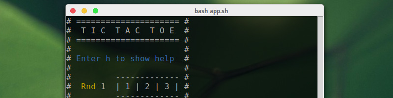

#Tic-Tac-Toe



Here is the original tic-tac-toe game! I made it in bash to improve my level
in shell scripts, and because the course was too boring :P! To play this game 
just follow instructions the below.

May the power of banana be with you!


###Use
```
git clone git@github.com:maloblanchard/tic-tac-toe.git
cd tic-tac-toe/
bash app.sh
```

###Warning
Single player is not implemented. So you can play alternately Player1 and then 
Player2, or (much better) play with a friend using an instant terminal 
sharing app, like [tmate](http://tmate.io/) ;).


###Thanks
Many thanks to [Romain Baumier](https://github.com/rbaumier)
for his help.


###Changelog
```
v0.3
 - Complete rewrite
v0.1 (2014-12-08)
 - Separation files + one method for one thing (SOC)
 - First attempt
```
